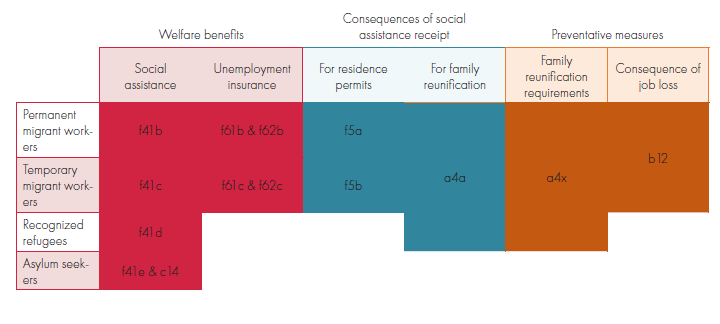

<h2> Migrant Social Protection </h2>

The project investigates variations in immigrant welfare rights, i.e. how they evolve over time, and how they differ between countries. 

MigSP offers a new set of quantitative comparative measures of de jure immigrant welfare rights in regard to unemployment insurance and social assistance benefits covering 39 countries in Europe, Latin America, North America, Oceania and Southeast Asia for the years 1980-2018. 

The data set covers the welfare rights of labor migrants, asylum seekers and recognized refugees. It contains indicators on access to social assistance and unemployment insurance as well as on the consequences of welfare benefit receipt and indirect measures preventing access to the benefits.

  

  
    

  
#### Next Steps

The project aims to further develop the MigSP data set using further funding via the Collaborative Research Centre "Global Dynamics of Social Policy" at the University of Bremen. In addition to social assistance and unemployment insurance, the data set will cover non-contributory child benefits, non-contributory old-age pensions and employment injury insurance in order to gain a more comprehensive vision of immigrant welfare rights. We also extend the data set to the years 2019 to 2021. 

---

 

#### Methodology 
   
MigSP builds on a methodology and set of questions that was developed in the realm of the Immigration Policies in Comparison (IMPIC) project. It uses a standardized questionnaire and works with legal experts to extract qualitative information from legal texts. The experts are sent an online questionnaire which contains both closed and open questions. The questionnaire is designed in such a way as to minimize the influence of subjective evaluations of restrictions of immigrant welfare rights. The qualitative data is then scored independently by a team of researchers to produce numerical country-year measures of immigrant welfare rights. 

---

#### Immigrant Welfare Rights

In the MigSP data set, immigrant welfare rights are understood as an umbrella term which encompasses a variety of direct and indirect restrictions for different groups of immigrants across an array of different benefit and services. For the operationalization of the concept, we compare the access of immigrants to that of citizens. In contexts where immigrants are granted rights equivalent to those of citizens, we define this as full inclusion, whereas full exclusion occurs when immigrants cannot access any of the benefits and services that are provided to citizens. Three dimensions need to be recognized: These are (1) the differences between types of migrants as differentiated by legal category, (2) differences between benefit types within a broader understanding of the welfare state, (3) differences between direct and indirect forms of restricting immigrant rights.
  

---

